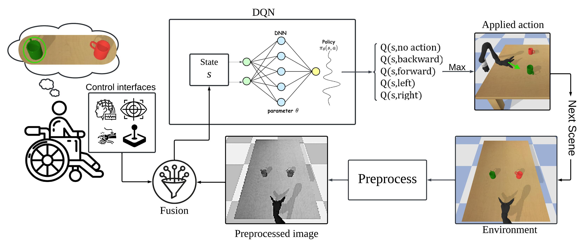

# STREAMS 
STREAMS (Self-Training Robotic End-to-end Adaptive Multimodal Shared autonomy) is a deep reinforcement learning framework that combines environment data and user input to produce smooth, stable end-effector trajectories for assistive robots, achieving a 96% success rate in simulations and 83% in user studies without requiring pre-existing datasets.



## Key Features of STREAMS

- **Deep Reinforcement Learning (DQN)**: STREAMS leverages a DQN pipeline for adaptive and self-training control of end-effector based assistive robots.
- **Multimodal Input Integration**: Combines synthetic user inputs and real-time environment data to generate smooth, robust trajectories.
- **Zero-Shot Sim-to-Real Transfer**: Achieves high task performance without the need for pre-existing datasets or extensive user data collection.
- **Synthetic Data for Training**: By using synthetic data during the training phase, STREAMS eliminates the need for any pre-existing datasets.
- **Trajectory Stabilization**: Significant improvements in trajectory smoothness and control, with a 96% success rate in simulations.
- **Assistive Mode Performance**: Demonstrates an 83% success rate in user studies, with enhanced task performance and user satisfaction in real-world scenarios.

## Demo


## Install:

```bash
# Step 1: Clone the repository
git clone https://github.com/ali-rabiee/STREAMS.git

# Step 2: Navigate into the project directory
cd STREAMS

# Step 3: Create a virtual environment (optional but recommended)
# For Windows:
python -m venv venv
venv\Scripts\activate

# For macOS/Linux:
python3 -m venv venv
source venv/bin/activate

# Step 4: Install the required packages from requirements.txt
pip install -r requirements.txt
```
## Quick start
```bash
python3 testDQN.py
```
## Train
In config.py you have access to training parameters you want to set and then you can simply run:
```bash
python3 trainDQN.py
```


